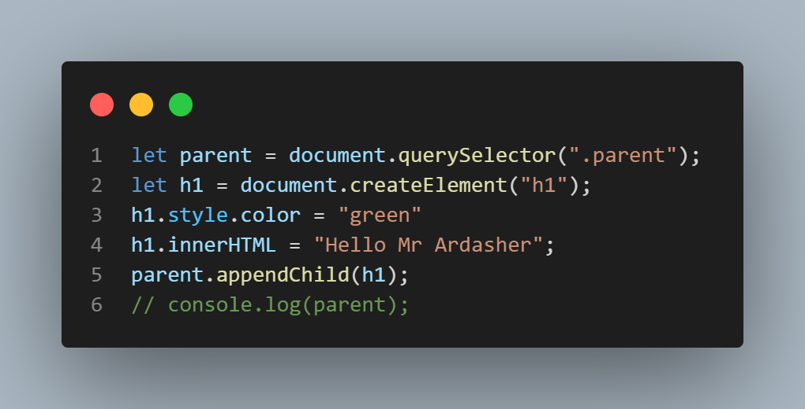
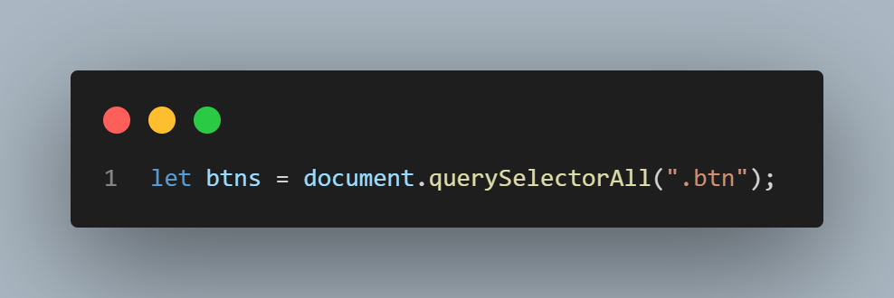
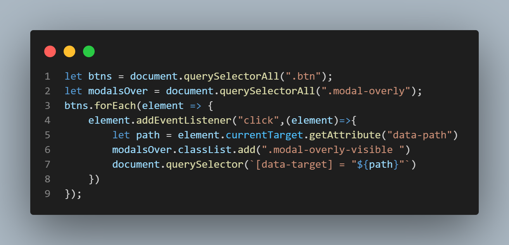

# DOM-Js-lecture-1

***DOM (Document Object Model)*** в JavaScript представляет собой структуру документа в виде объектов. Документ веб-страницы в браузере представлен объектной моделью, где каждый элемент страницы является отдельным объектом. С помощью DOM-интерфейса можно изменять содержимое и структуру документа, добавлять, удалять или переносить элементы. Этот подход позволяет веб-страницам динамически реагировать на действия пользователя и изменять содержимое без перезагрузки страницы. DOM является одним из базовых элементов интерактивного программирования на вебе.

DOM (Document Object Model) - это представление HTML-документа в виде дерева объектов, которые можно изменять с помощью JavaScript. DOM предоставляет доступ к элементам документа и позволяет изменять их содержимое, стили, атрибуты и многое другое.

### BOM What is BOM in js 

***BOM (Browser Object Model) в JavaScript*** - это объектная модель браузера, которая предоставляет доступ к функциям браузера, таким как история браузера, URL-адрес, загрузка документов и т.д.

BOM не является частью стандарта ECMAScript, но предоставляется браузерами для управления окном браузера и его компонентами.

Некоторые из объектов BOM, доступных в JavaScript, включают объекты window, document, navigator, location, history, screen и другие.

**querySelector()** - Метод querySelector() возвращает первый дочерний элемент, который соответствует указанному CSS-селектору(-ам) элемента. Метод querySelectorAll() может быть использован для доступа ко всем элементам, которые соответствуют указанному CSS-селектору.

***innerHTML*** - Это свойство предоставляет простой способ полностью
заменить содержимое элемента. Например, все содержимое
элемента body может быть удалено:

***createElement()***  - Метод JavaScript document.createElement() позволяет создать и вернуть новый элемент (пустой узел Element) с указанным именем тега.
Создает элемент HTML с тегом, переданным в качестве параметра. Возвращает созданный элемент.

***appendChild()*** - Метод "appendChild()" добавляет узел (элемент) последним дочерним элементом для указанного элемента.
appendChild() добавляет узел в конец списка дочерних элементов заданного родительского узла. Если данный дочерний элемент является ссылкой на существующий узел в документе, то функция appendChild() перемещает его из текущего положения в новое положение.

**ClassList** - 
1. add( String [,String] )
Добавляет указанные классы элементу.

2. remove( String [,String] )
Удаляет указанные классы из элемента.

3. toggle(String[, Boolean])
Если у элемента нет указанного класса, то метод добавляет его, иначе - удаляет. Если вторым параметром передается значение false, то метод удаляет указанный класс, а если true, то добавляет его.

Если второй параметр не определен (undefined) или является переменной с типом данных 'undefined', то поведение метода будет таким же, как и при вызове метода с передачей только первого параметра.

